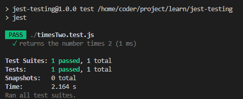
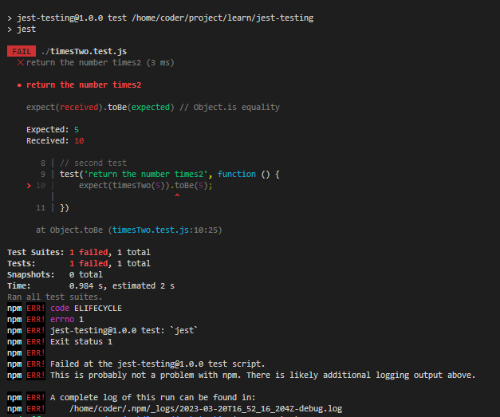

# Lab Instructions: Unit Testing
 
> ### **Tips: Before you Begin**
> #### **To view your code and instructions side-by-side**, select the following in your VSCode toolbar:
> - View -> Editor Layout -> Two Columns
> - To view this file in Preview mode, right click on this README.md file and `Open Preview`
> - Select your code file in the code tree, which will open it up in a new VSCode tab.
> - Drag your assessment code files over to the second column. 
> - Great work! You can now see instructions and code at the same time. 
> - Questions about using VSCode? Please see our support resources here:  
> [Visual Studio Code on Coursera](https://www.coursera.org/learn/programming-with-javascript/supplement/roMvE/visual-studio-code-on-coursera)
> #### **To run your JavaScript code**
> - Select your JavaScript file
> - Select the "Run Code" button in the upper right hand toolbar of VSCode.  
> Ex: It looks like a triangular "Play" button. 
<br><br>

## Task 1: Add Jest as a devDependency

Open terminal. Make sure that it's pointing to `jest-testing` directory.
```
cd jest-testing
```
Install the jest npm package using the npm install command and the --save-dev flag. 
```
npm install --save-dev jest
```
Verify that the installation was completed successfully by opening the package.json file and confirming that the "devDependencies" entry lists jest similar to the following:

```
"devDependencies": {
    "jest": "^28.0.0"
}
```
<br>

## Task 2: Update the test entry

In the package.json file, locate the "scripts" entry, and inside of it, update the test entry to `jest`.
```
 "scripts": {
    "test": "jest"
  }
```
<br><br>

## Task 3: Code the timesTwo function

Open the timesTwo.js file and add a function named `timesTwo`. The function should take number as input and return the value 2 multiplied by the number.
Export the timesTwo function as a module.

```
// Task 1: Code the timesTwo function declaration
function timesTwo(num){
    return num*2;
}

// Task 2: Export the timesTwo function as a module
module.exports = timesTwo;
```

<br><br>

## Task 4: Write the first test
Open the timesTwo.test.js file.
Code a test call with the following arguments: 
1. The description that reads: "returns the number times 2". 
2. The second argument should expect the call to the timesTwo function, when passed the number 10, to be 20.

```
const timesTwo = require('./timesTwo');

// Write the first test
test('returns the number times 2', () => {
    expect(timesTwo(10)).toBe(20);
});
```


<br><br>

## Task 5: Run the first test 
With the terminal pointed at the `jest-testing` directory, run the test script using npm.
> Open terminal. Make sure that it's pointing to `jest-testing` directory.
```
cd jest-testing
npm run test
```
## Results
> ### Test pass
> 

> ### Test fail
> 


